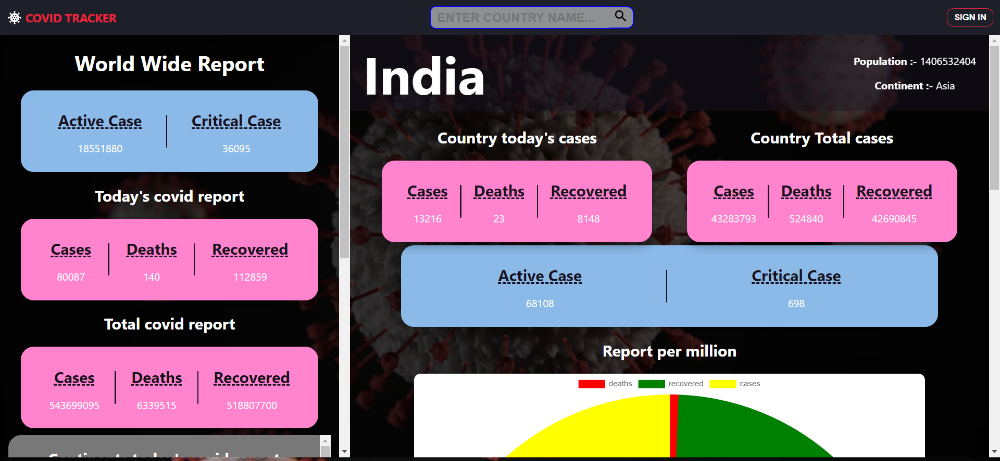
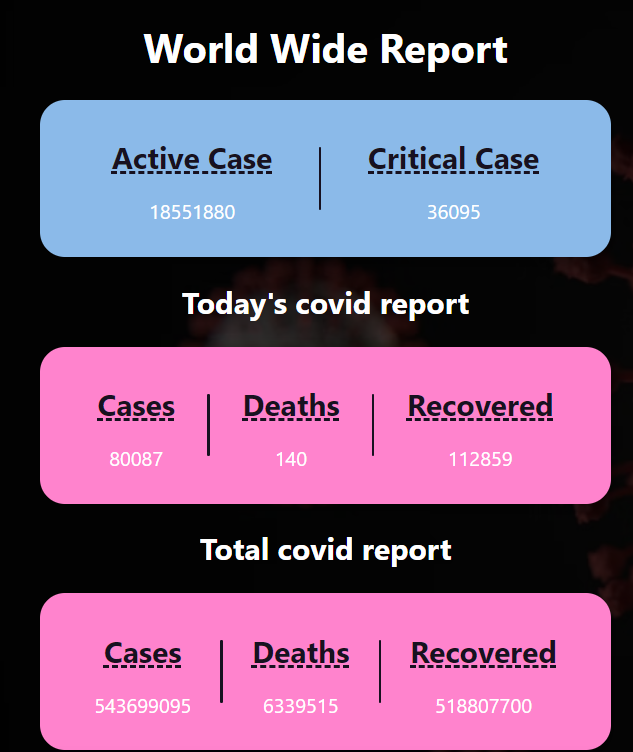
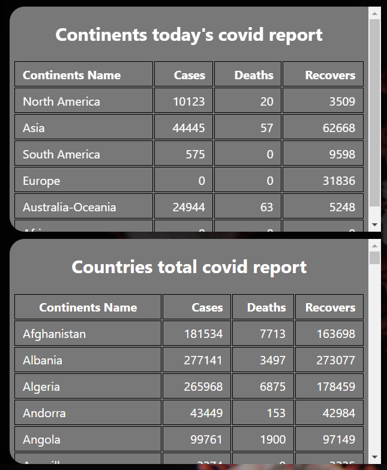
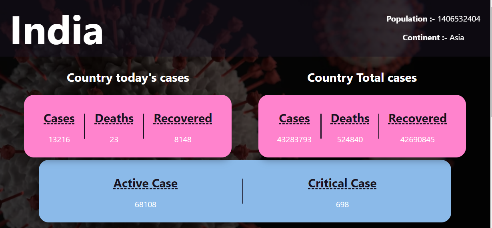
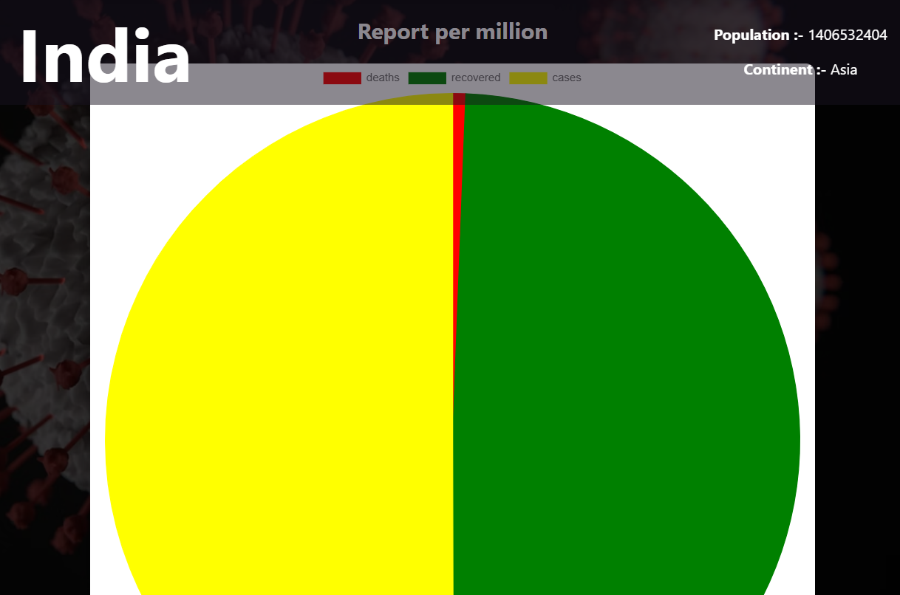
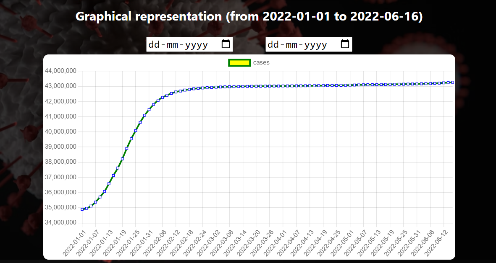

# covid-tracker
<br>

# About the Website


### This website is a covid tracker web application. In this application you have to signin to search any country wise data. On home page you will also see data around world, data of continents wise base and total data of all countries. 
<hr/>

## Data Source for Covid-19
* [data source](https://corona.lmao.ninja)
* [For graph](https://covid19api.com/) 
<hr/>

## Steps to run application on local server

* Clone this repository locally than to following for starting local server for backend or frontend.

* <kbd>npm start</kbd> ==> After clone you on main folder you will files for backend. In backend you users data is being stored. To start server without any error you have to provide database link and jwt token key  you can provide that by you local database by simply adding a .env file. Firstly you have to install npm package by npm install.
  
 * <kbd>npm run dev</kbd> ==> On main folder you will see a folder named covid-tracker-app, this is the main react application after opening that folder you will see all files related to application. To start application on local server you have to run this command in terminal. Firstly you have to install npm package by npm install. 
<hr/>

## TechStacks
* React
* Redux
* MongoDB
* ExpreeJS
* NodeJS
* JavaScript
* CSS
* Heroku
* Vercel
<hr/>

## Deployed Link

```bash
  https://deepu2560-covid-tracker.vercel.app/
```


# Features

* ##  Sign-up

<br />

* ##  Sign-in

<br />

* ##  Home page

<br />

* ##  World wide report (total and current)

<br />

* ##  continents and countries report

<br />

* ##  Searched coutry report

<br />

* ##  Pie chart (report per million)


* ##  graphical representation of cases


<hr />
Thank you ❤️


